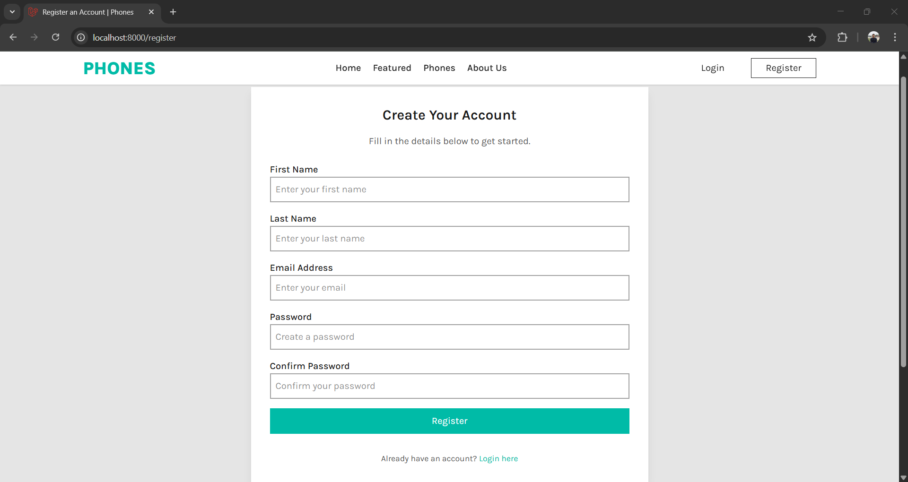

# Laravel E-commerce Website

This is a basic e-commerce website built with Laravel framework. The website has the following features:

- User authentication and authorization
- User profile management
- Phone management (CRUD operations)
- Cart management (add, remove, update)
- Order management (CRUD operations)
- Checkout process
- Admin dashboard to manage phones, orders, and users

## Screenshots

### Home Page

### Phones Page

### Phone Details Page

### Login Page

### Register Page

### User Dashboard

### User Edit Credentials

### User Orders

### Cart Page

### Checkout Page

### Order Confirmation Page

### Admin Dashboard

### Admin Phones Page

### Admin Phone Create Page

### Admin Phone Edit Page

### Admin Orders Page

### Admin Order Edit Page

### Admin Users Page

### Admin User Details Page

## Installation

1. Clone the repository
2. Run `composer install` to install the dependencies
3. Run `php artisan migrate` to create the database tables
4. Run `php artisan db:seed` to seed the database with sample data
5. Run `php artisan serve` to start the development server

## Usage

1. Open the website in a web browser
2. Register or log in as a user
3. Browse the phones and add them to the cart
4. Proceed to checkout and complete the order
5. Log in as an admin to manage phones, orders, and users

## License

This project is licensed under the MIT License. See the [LICENSE](LICENSE) file for details.
